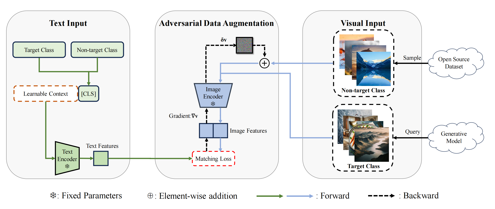

# OCC-CLIP ECCV2024
This repository contains the code and data for the paper ["Which Model Generated This Image? A Model-Agnostic Approach for Origin Attribution"](https://arxiv.org/abs/2404.02697v2) accepted by ECCV 2024.
## Overview
Overview of OCC-CLIP


# 🗓 Coming Soon
- [x] Code release of our [paper](https://arxiv.org/abs/2404.02697v2)
- [x] Complete Instructions

## Demo
A Simple Demo


## Requirements
The environment.yml file contains the necessary packages to run the code. You can create the environment using the following command:
```
conda env create -f environment.yml
```

## Train
To obtain the perturbation, you can use the following command:
```
python run.py --train --train_real coco_test --train_target sdv1 --train_set 1 --n_epoch 200 --lr 0.0001 --Use_Attack --epsilon 0.1 --n_shots 50 --save_path {PATH}
```

## Test
To run the inference, you can use the following command:
```
python run.py --train_real coco_test --train_target ${TRAINF} --test --test_target ${TRAINF} --test_other ${OTHERDATASET} --train_set ${TRAIN_SET} --n_epoch ${EPOCH} --lr ${LR} --Use_Attack --epsilon ${EPSILON} --n_shots ${NSHOTS} --save_path {PATH}
```


## Clarifications
This task is very sensitive. We ran it on NVIDIA A40 GPUs.
You need to set 
```
random.seed(1)
np.random.seed(1)
torch.manual_seed(1)
torch.cuda.manual_seed(1)
torch.cuda.manual_seed_all(1)
torch.set_printoptions(precision=8)
torch.backends.cudnn.deterministic = True
torch.backends.cudnn.benchmark = False
```
to get same experimental results each time.

## Dataset used in the paper

- The default non-target dataset used in the paper is a subset of MSCOCO validation set. There are a total of 202,520 fake images generated by five different generative models, namely, Stable Diffusion Model, Latent Diffusion Model, GLIDE, Vector Quantized Diffusion, and GALIP.
- We also utilized pre-existing datasets (namely GauGAN, ProGAN, and StyleGAN2) as provided by https://github.com/peterwang512/CNNDetection.
- We provide the dataset in the dataset/ directory. Generated images can be downloaded from [here](https://drive.google.com/file/d/10uFtyVs7YewC-nqpHu9c57sqs4R_2Z20/view?usp=sharing)

## Acknowledgement
We would like to thank the authors of the following repositories for their code: https://github.com/KaiyangZhou/CoOp

## Citation
If you find this repository useful, please consider citing our paper:
```
@misc{liu2024which,
      title={Which Model Generated This Image? A Model-Agnostic Approach for Origin Attribution}, 
      author={Fengyuan Liu and Haochen Luo and Yiming Li and Philip Torr and Jindong Gu},
      year={2024},
      eprint={2404.02697v2},
      archivePrefix={arXiv},
      primaryClass={cs.CV}
}
```